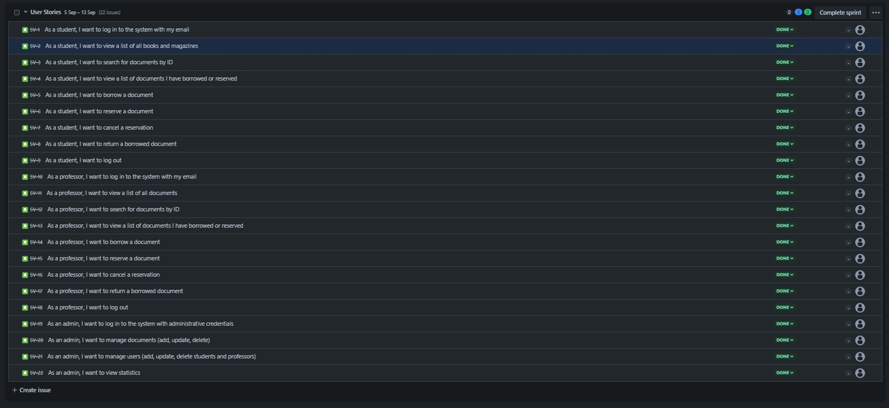
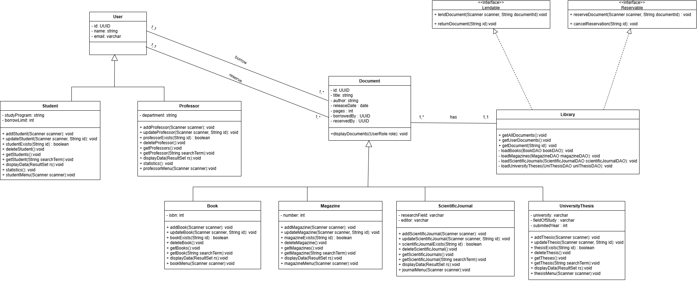
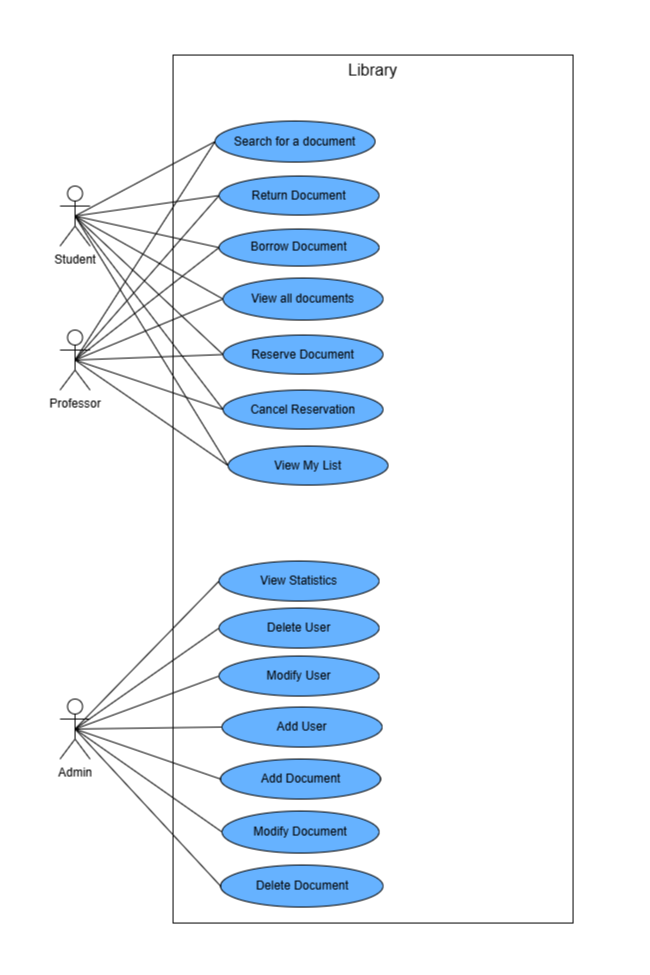

# 📚 Welcome to ShelfMaster! 📚

Hello, Librarians and Knowledge Enthusiasts! 👋

Welcome to **ShelfMaster**, your advanced and efficient console-based library management system! Whether you're a student, professor, or an administrator, **ShelfMaster** simplifies the management of your books, scientific journals, magazines, and university theses, all while being seamlessly integrated with a PostgreSQL database.

## 🚀 About ShelfMaster

**ShelfMaster** offers a robust solution for managing a wide variety of library documents with ease. Its modular architecture includes clear separation between business logic, data access, and user interaction. With a clean console-based interface, you can manage everything from book borrowing to reservations while utilizing advanced Java concepts and a well-organized database for persistence.

## 📁 Project Structure

Here's an overview of the project structure for **ShelfMaster**:

- **business**: This layer contains the core business logic for managing documents and users.
    - **Interfaces**:
        - `Lendable`: Interface that provides the `lend()` and `returnItem()` methods for managing lending operations.
        - `Reservable`: Interface that provides the `reserve()` and `cancelReservation()` methods for managing reservations.
    - **Classes**:
        - `Book`: Represents a book document in the library.
        - `Document`: The abstract base class for all types of library documents.
        - `Library`: Handles the overall management of the document collection in the library.
        - `Magazine`: Represents a magazine document.
        - `ScientificJournal`: Represents a scientific journal document with specific attributes such as research domain.
        - `UniversityThesis`: Represents a university thesis, with attributes like university and domain.
        - `User`: Abstract base class representing a library user.
        - `Student` and `Professor`: Concrete subclasses of `User`, each with specific attributes and permissions.

- **config**: Handles database configuration and session management.
    - `ConnectionManager`: Manages database connections.
    - `Session`: Manages user sessions for the library application.

- **dao (Data Access Objects)**: This layer provides the DAO interfaces and implementations for interacting with the PostgreSQL database.
    - **Interfaces**: DAO interfaces for different document and user types, including:
        - `BookDAO`
        - `DocumentDAO`
        - `MagazineDAO`
        - `ProfessorDAO`
        - `ScientificJournalDAO`
        - `StudentDAO`
        - `UniThesisDAO`

- **ui**: Contains the `ConsoleUI` class, which manages user interactions via the console interface.
    - `ConsoleUI`: Provides a console-based interface for interacting with the system and performing various actions like borrowing, returning, and reserving documents.

- **utils**: Contains utility classes.
    - `LibraryApp`: The entry point of the application, initializing the system and starting the console UI.

- **resources**: Contains configuration files and SQL scripts.
    - `app.properties`: Stores database configurations and other application settings.
    - `ShelfMaster.sql`: The SQL file for creating the necessary database schema.

## 🧩 Key Features

- 📚 **Manage Documents**: Add, modify, or delete various document types such as books, magazines, scientific journals, and university theses.
- 🔍 **Search & Filter**: Advanced search functionality for filtering documents by title, author, or type.
- 📝 **Borrow & Return Tracking**: Keep track of all borrowings and returns for library users.
- 🔐 **User Management**: Manage both student and professor accounts with different permissions for borrowing and reserving.
- 🛠 **Database Integration**: Seamless integration with PostgreSQL, allowing for persistent storage of all library records.

## 🚩 Jira Board

Here's a snapshot of the Jira board used for managing the project tasks and issues:
[](./src/main/resources/Jira.jpeg)

## 🎨 UML Diagrams

Here's a UML `Class Diagram` and `UseCase Diagram` to give you a high-level view of the architecture:

### Class Diagram:
[](./src/main/resources/UML.png)

### UseCase Diagram:
[](./src/main/resources/UseCase.png)


## 🛠️ How to Use ShelfMaster

### Prerequisites

Ensure you have the following installed on your machine:

- **Java 8** or later
- **PostgreSQL** database with the necessary tables and schema (setup instructions below)
- **JDBC Driver** for PostgreSQL
- A console or terminal to run the application

### Installation

1. Clone this repository to your local machine:
   ```bash
   git clone https://github.com/zinebMachrouh/Shelfmaster_v2.git
   cd Shelfmaster_v2
    ```

2. Create a PostgreSQL database and run the SQL script to set up the necessary tables:
    ```bash
    psql -U yourusername -d yourdatabase -f resources/ShelfMaster.sql
    ```
    Replace `yourusername` and `yourdatabase` with your PostgreSQL username and the name of the database you want to create.

3. Update the `app.properties` file in the `resources` directory with your database connection details.

### Running the JAR File
To run the application, execute the following command:
```bash
     cd out/artifacts/ShelfMaster_jar
     java -jar ShelfMaster.jar
```

### Example Commands in Console
- **Add a document:** You will be prompted to enter details like title, author, release date, etc.
- **Search documents:** Search for documents by title, author, or type.
- **Borrow/Return:** Handle document borrowing and return actions for users.
- **Manage users:** Add or modify student or professor accounts, manage their borrowing permissions.

## 🎉 Join the ShelfMaster Family!
Ready to streamline your library management? Jump into ShelfMaster and transform how you manage your library's collections today!

For any questions, feedback, or suggestions, feel free to reach out to us. I'd love to hear from you! 📧